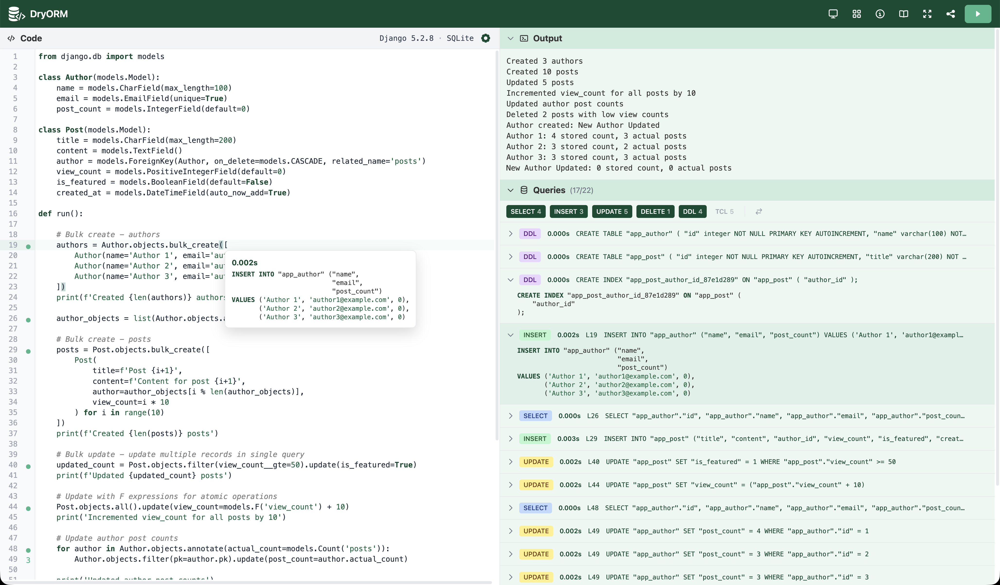

# DryORM

A playground for testing Django ORM model configurations and queries in an isolated, sandboxed environment.



## Features

- Write and execute Django ORM code in the browser
- Execute code against Django PRs, branches, and tags
- View generated SQL queries with execution times
- Auto-generated ERD diagrams from your models
- Shareable code snippets
- Zen mode for distraction-free coding
- Vim keybindings support

## Quick Start

### Prerequisites

- Docker and Docker Compose
- Git

### Setup

1. Clone the repository:
2. Create a `.env` file in the project root:

```shell
PROJECT=dryorm
TAG=latest
DEBUG=True
PYTHONUNBUFFERED=1
SECRET_KEY="your-secret-key"
ENVIRONMENT=development

# Database
POSTGRES_USER=dryorm
POSTGRES_PASSWORD=dryorm
POSTGRES_DB=dryorm
POSTGRES_HOST=database

# Optional: GitHub token for higher API rate limits
GITHUB_TOKEN=""
```

3. Build and start the stack:

```shell
docker compose build
docker compose up -d
```

The application will be available at `http://localhost:8000`.

## Development

```shell
make frontend-install  # Install frontend dependencies
make frontend-watch    # Watch mode for frontend development
make frontend-build    # Production build
make clean             # Clean build artifacts
```

## Executor Specification

Executors are isolated Docker containers that run user-submitted code. To create a custom executor:

### Requirements

- A self-sufficient Docker image (preferably lightweight)
- Accepts `CODE` as an environment variable
- Returns JSON on success or exits with non-zero status on failure

### Response Format

```json
{
  "erd": "base64-encoded-erd-image",
  "output": "print output here",
  "returned": [
    {"column1": "value1", "column2": "value2"}
  ],
  "queries": [
    {"sql": "SELECT * FROM ...", "time": "0.001"}
  ]
}
```

### Example

```shell
docker run --rm -e CODE="$(cat models.py)" dryorm/executor
```

### Configuration

Define executors in the backend constants:

```python
EXECUTOR = Executor(
    image='dryorm-executor/python-django',
    key='python/django',
    memory='75m',
    verbose='Python - Django',
    max_containers=5,
)
```

## GitHub Integration

DryORM can fetch and run code against any Django reference from the official repository:

- **Pull Requests** - Test upcoming features or bug fixes before they're merged
- **Branches** - Run against development branches like `main` or stable branches
- **Tags** - Use any Django release tag (e.g., `v5.2`, `v4.2.10`)

References are cached locally using git worktrees for fast subsequent access. This is useful for:
- Validating that a PR fixes your issue
- Testing code against unreleased Django versions
- Comparing behavior across different Django releases

To use, click the settings icon and select "GitHub Reference" to search and fetch the desired PR, branch, or tag.

## Tech Stack

**Frontend:** React 18, Vite, Tailwind CSS, CodeMirror 6

**Backend:** Django 5.2, PostgreSQL, Redis, Docker

**Executors:** Isolated Docker containers running Django 4.2/5.2 with PostgreSQL or MariaDB


## FAQ

**Why does this exist?**

To quickly test and share executable ORM snippets without setting up a full Django project.

**Is this an official Django Software Foundation project?**

No. This is a personal project. The theme is inspired by Django's official website.

**Does it support other ORMs?**

The architecture is ORM-agnostic. You will find existing executors for **SQLAlchemy** and **PrismaJS** in the repository, but they are disabled in production.

## Attributions

- Line-aware query logger is attributed to [Tktech](https://github.com/TkTech)'s [WetORM](https://github.com/TkTech/wetorm)

## License

MIT License - see [LICENSE](LICENSE) for details.
